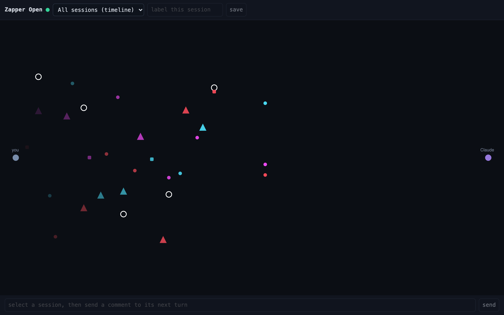
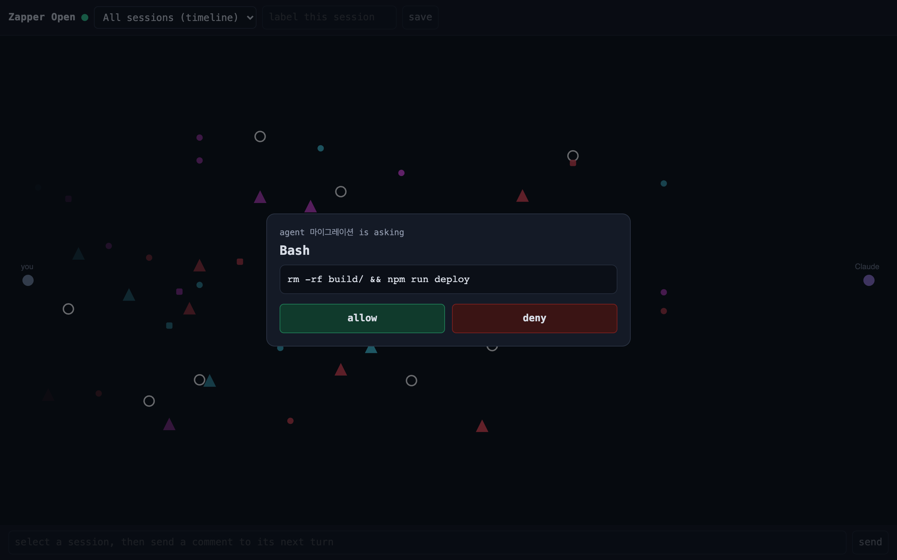

# Zapper Open

English · [한국어](README.md)

The smallest possible dashboard for watching a Claude Code session in your browser.




- Every time the AI uses a tool, a particle flows across the screen — you see what is happening as a picture, not a wall of text.
- Send a "comment" from the page and it is injected into the front of that session's next turn.
- Approve sensitive tools (Bash, Edit, Write) from a web modal. If you do not answer, it falls back to the normal terminal prompt.
- Run several sessions at once: each gets a stable colour, and you filter by session with the picker.

Single user, local only. All state lives in memory and is gone when the process stops. No database, no cloud, no external auth.

> This repo is the publishable core of a larger private tool ("Zapper"). Codex nodes, usage quotas, file uploads, an embedded terminal, and more are intentionally left out. The goal is to show the three core layers (hooks -> bridge -> visualization) as small as they can be.

## Layout

```
zapper-open/
├── server/index.js     Node bridge (Express + ws). Events, sessions, comment queue, approvals. In-memory.
├── web/                p5.js single-page dashboard (index.html · app.js · styles.css)
├── hooks/              pre-tool-use-health-gate.sh — denies gated tools when the bridge is down
├── settings-snippet.json   hooks to merge into ~/.claude/settings.json
└── scripts/install.sh  merges the hooks into settings.json (with backup + path substitution)
```

How it works: Claude Code calls hooks at moments like before/after a tool runs, when a response ends, and when you submit a prompt. Most hooks here are `{"type":"http"}`, so events arrive straight at the bridge's URL with no extra script. The bridge relays them to the browser over WebSocket, and for gated tools it withholds its response until the browser answers.

## Quick start

Requires: Node 18+, `jq`, `curl`.

```bash
# 1. install deps (just express + ws)
npm install

# 2. start the bridge
npm start
# [zapper] listening on http://127.0.0.1:8089

# 3. open the browser
open http://127.0.0.1:8089/

# 4. connect the hooks (the key step — without it the dashboard is up but empty)
bash scripts/install.sh

# 5. restart Claude Code (settings.json is loaded at session start)
```

Now give Claude Code any task and particles flow across the dashboard.

## Using it

- **Pick a session**: the header picker. Default is "All sessions (timeline)" — every session merged together.
- **Label**: select a session, type a label, save. It shows a human name instead of a UUID.
- **Send a comment**: select a session, type into the bottom box, send. It is prepended to that session's next prompt. (It does not attach to a turn already in progress — send it before the next prompt.)
- **Approve**: Bash / Edit / Write / NotebookEdit calls pop a modal. allow / deny. If you do not answer within 120s, the modal closes and Claude Code falls back to its own terminal prompt — so it is safe to leave the browser unattended.

## External / mobile access (Tailscale)

To watch from your phone or another PC, install [Tailscale](https://tailscale.com) (a private mesh network) and bind the bridge to your Tailscale IP:

```bash
ZAPPER_TOKEN=$(openssl rand -hex 32) ZAPPER_HOST=$(tailscale ip -4) npm start
```

When `ZAPPER_HOST` is not localhost the bridge also binds 127.0.0.1, so the hooks' default target (127.0.0.1:8089) keeps receiving events. From your phone's Tailscale browser, open `http://<Tailscale IP>:8089/?token=<value>`.

- Reachable only inside your Tailscale network. Not exposed to the public internet.
- Always set `ZAPPER_TOKEN` when exposing beyond localhost. Hook payloads carry commands and file paths.

## Security

- Binds `127.0.0.1` by default. Reachable only from the same machine.
- To enable a token: `ZAPPER_TOKEN=$(openssl rand -hex 32) npm start`. Open the browser at `http://127.0.0.1:8089/?token=...`, and give the hooks the same token via an environment variable.
- Hook payloads contain commands, file paths, and the like. Running without a token is for a trusted single-user local machine only.

## Environment variables

| Variable | Purpose | Default |
|---|---|---|
| `ZAPPER_HOST` | bridge bind address | `127.0.0.1` |
| `ZAPPER_PORT` | port | `8089` |
| `ZAPPER_TOKEN` | shared token (optional) | unset |
| `ZAPPER_APPROVAL_TIMEOUT_MS` | how long to wait for a web approval | `120000` |

## Build it yourself

This repo is the "answer key". Ask Claude Code to build it step by step and you end up with the same thing. Do not build it all at once — go one hook, then one bridge route, then one particle, checking each on screen as you grow it.

## License

MIT.
